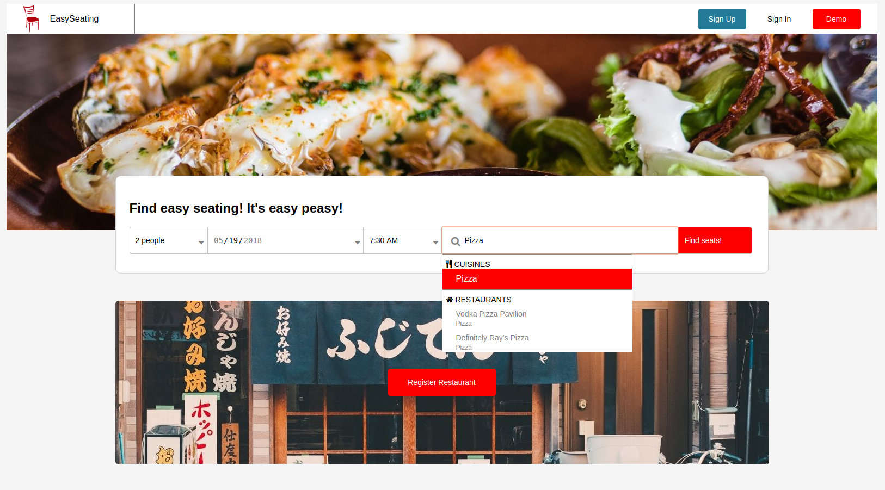
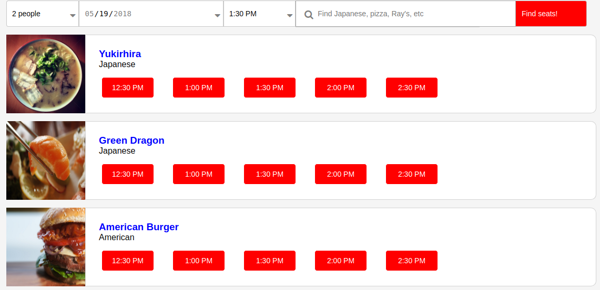
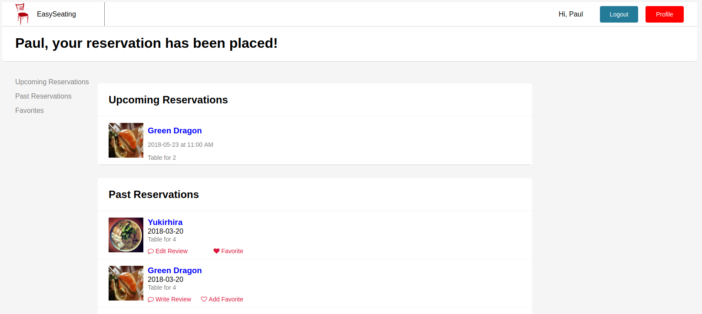
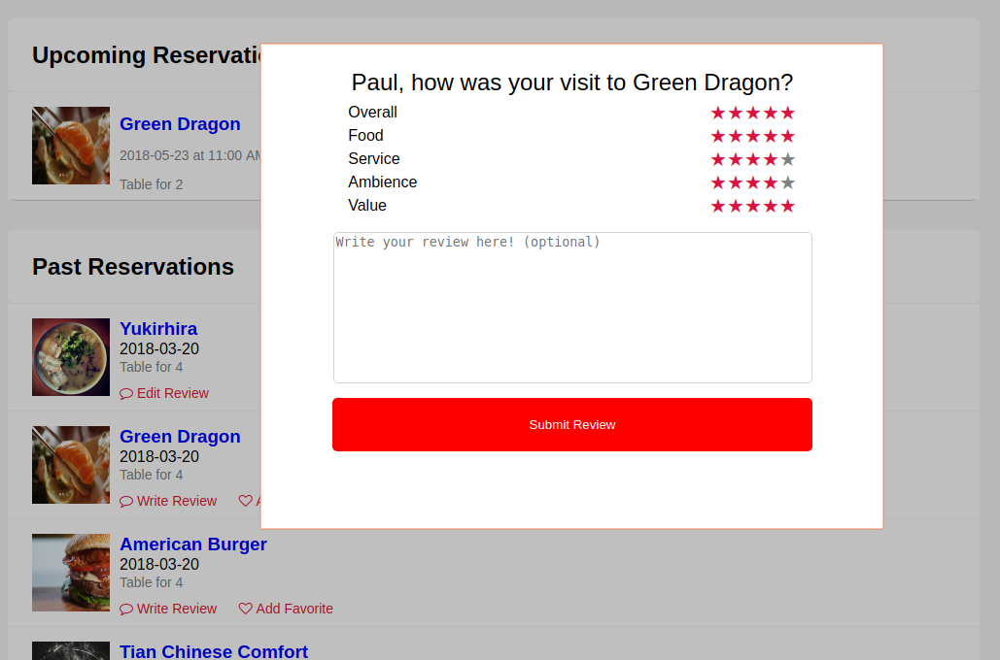

# EasySeating
---
[Live](https://easyseating.herokuapp.com/#/)
EasySeating is a full-stack web application inspired by OpenTable. It uses React/Redux on the frontend and uses Ruby on Rails in the backend with a postgres database.

## Features
### Searching Restaurants and Reservations
---
#### Restaurant Search
The home screen and restaurant index page feature a restaurant search form, which takes in inputs `seats`, `date`, `time`, and user-entered text. When the user enters text, a dropdown appears showing possible restaurants that match the entered text.



The specific restaurant pages don't need search bars, so it made sense to separate the features of the restaurant form into separate components.

```javascript
// Restaurant Search Components uses SeatTimeDate and SearchBar components
render() {
  return (
    <form className='search-restaurant-div' autoComplete='off'>
      <SeatsTimeAndDate
        handleAnyChange={this.handleAnyChange}
        parentState={this.state} />

      <SearchBarContainer
        parentState={this.state}
        handleSearchBarChange={this.handleSearchBarChange}
        handleSubmit={this.handleSubmit} />

      <button
        className="find-stuff-button"
        onClick={this.handleSubmit}>
        Find seats!
      </button>
    </form>
  );
}
```

In order to allow for slight mistyping, the match is based on a trigram comparison between the search term and the restaurants in the database. This way, users can find restaurants with foreign or unfamiliar spellings without much difficulty.

```ruby
def self.text_search(query)
  self
    .where("similarity(name, ?) > 0.2", query)
    .order("similarity(name, #{ActiveRecord::Base.connection.quote(query)}) DESC")
    .limit(10)
end
```

#### Reservation Search
The homepage, restaurant index page and each restaurant page can list reservations that match certain search criteria for the relevant restaurant(s). Clicking the `Find seats!` button automatically runs a database query that finds open reservations (reservations with `user_id IS NULL`) within one hour of the selected time that match the other search criteria and displays buttons.


When one of these buttons is clicked, either the application will prompt the user to log in or it will make the reservation and navigate the user to his profile page, where he can see the reservation and all others like it.

### PROFILE
---
The profile page has three main functions: showing all past and future reservations, allowing users to leave reviews for restaurants, and allowing users to favorite or unfavorite restaurants. There is a navbar that allows users to quickly navigate to the section of the profile page that handles each feature.


---
#### Upcoming and Past Reservations
When the profile page loads, the application distinguishes between upcoming and previous reservations and sorts them into separate categories. Future reservations list the date, time, and seats reserved for a given restaurant. Past reservations list the date a reservation was made for a restaurant, and allows the user to favorite the restaurant or review it.

#### Reviews
A review can be left once for each reservation, and can be edited at the user's discretion. The review leaves a rating for each of many properties of his/her dining experience as well as an overall rating. The user can choose to, but is not required to, leave a written review as well. Once a review exists, the `Write Review` prompt is replaced by an `Edit Review` prompt.



#### Favorites
All previously visited restaurants can be favorited. When this is done, the favorite is added to the 'favorites' tab on the user page. Favorites are made by way of a simple join table connects a restaurant to a user through a reservation. Clicking on the favorite tag for a favorited restaurant will remove a restaurant from the favorite list, and the favorite restaurant list and favorite tag will update accordingly.

## Future Improvements
---
Some quality of life improvements may be added, such as letting users leave reviews from the restaurant pages. I may use AWS to store additional photos for each restaurant beyond the profile picture as well, and allow users who run restaurants to add photos.
